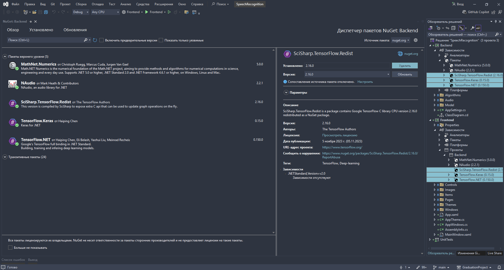
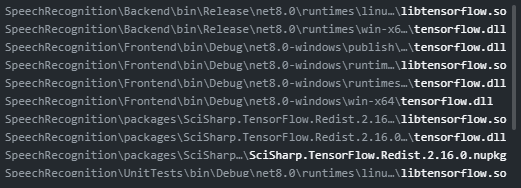

# Speech Recognition Project

## Overview
This project is designed to create, configure, and train speech recognition models. It enables transcription of audio into text and builds phoneme recognition matrices for audio frames.

### Key Features:
- **Audio Transcription**: Converts speech to text with high accuracy.  
- **Phoneme Recognition**: Constructs sequences of phonemes from audio data.  
- **Deep Learning Integration**: Leverages Deep Neural Networks (DNN) for speech analysis.

---

## How It Works
1. **Feature Extraction**: Extracts audio features using Mel-Frequency Cepstral Coefficients (MFCC).  
2. **Neural Network Processing**: Passes extracted features to a Deep Neural Network (DNN) for classification.  
3. **Phoneme Sequence Construction**: Clusters sounds and constructs a sequence of phonemes.  
4. **Dictionary Comparison**: Compares the resulting phoneme sequence with a predefined dictionary for transcription.

---

## How to Launch

### Install Required Libraries:
Ensure the following libraries are installed:
- `SciSharp.TensorFlow.Redist 2.16.0`
- `TensorFlow.Keras 0.15.0`
- `TensorFlow.NET 0.150.5`
These can be installed using NuGet

### Library Installation Notes:
- Install the libraries specifically for the **Backend** project.  
- After installation and building the project, the libraries should also appear in:
  - `bin` folder of the **Frontend** and **UnitTests** project dependencies.  
  - `packages` folder in the project root.

### Refer to the Images:
Two PNG files, `Libraries.png` and `Libraries 2.png`, are located in the root folder. They provide visual hints on where and how to install the required libraries.

